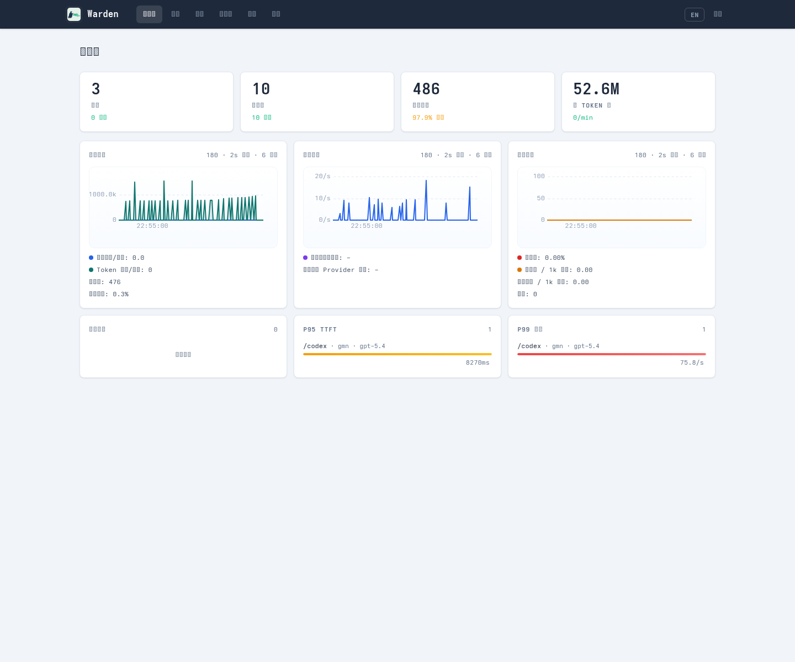
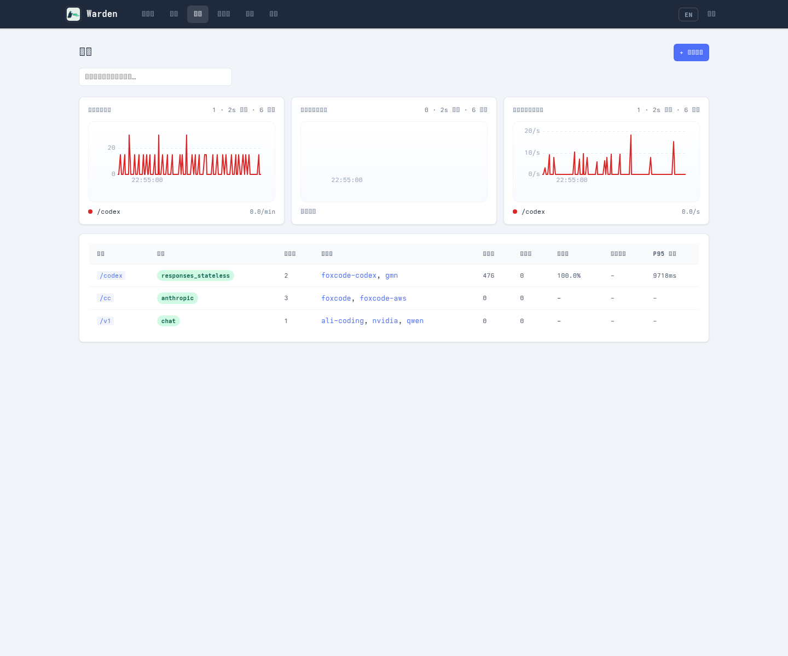

# Warden

- [中文](#中文)
- [English](#english)

## 中文

Warden 是一个以 `route` 为中心的 AI 网关。

它把多个上游 provider 收到同一个服务后面，对客户端暴露稳定入口，对管理员暴露路由、状态、日志和配置控制面。

一句话理解：

- 对客户端：一个统一的模型入口
- 对管理员：一个可观测、可切换、可调试的 AI gateway

文档入口：

- 项目入口：[README.md](./README.md)
- 架构说明：[ARCHITECTURE.md](./ARCHITECTURE.md)
- 专题文档索引：[docs/README.md](./docs/README.md)
- 配置说明：[config/README.md](./config/README.md)

### 它解决什么问题

- 不同 provider 的地址、鉴权、协议细节不一致
- 客户端不想写死大量 provider 和 model 分支
- 某个上游失败时需要自动切换备选
- 需要知道请求打到哪里、谁在失败、哪些 key 在消耗
- 希望对模型返回的 tool call 做审计或附加动作

### 当前边界

- 统一接入 `openai`、`anthropic`、`copilot`
- Qwen 兼容上游统一按 `openai` provider 配置；不再提供原生 `qwen` CLI 适配
- OpenAI-compatible 上游（包括 Ollama）统一按 `openai` provider 配置；若只支持聊天接口，显式设置 `service_protocols: [chat]`
- CLIProxyAPI/cliproxy 作为 OpenAI-compatible backend 接入，例如 `family: openai`、`backend: cliproxy`、`backend_provider: codex`
- 可选启动嵌入式 CLIProxyAPI/cliproxy 服务，随 Warden 进程一起启停
- 以 `route.protocol + model` 决定对外暴露的协议面
- 支持 `chat`、`responses_stateless`、`responses_stateful`、`anthropic` 四种 route 协议
- 支持 OpenAI-compatible `/embeddings`；`chat` / `responses_*` / `anthropic` route 只有在至少存在一个 embeddings-capable upstream/provider 时才会暴露该入口
- `exact_models` 用有序 `upstreams`，`wildcard_models` 用有序 `providers`
- failover 只发生在命中的 route model 候选列表内
- 提供管理后台、请求日志、SSE 流、Prometheus 指标和 token usage 观测
- 支持 route 级客户端 API Key、按 key 统计、工具调用 Hook：`exec`、`ai`、`http`
- 支持 `responses_to_chat` 与 `anthropic_to_chat` 桥接，但它们都是受限兼容模式，不是任意协议互转

### 不再支持

下面这些已经不是当前产品边界，不要再按旧文档理解：

- 内置 MCP client 运行时
- SSH 远程执行与 `ssh` 配置块

如果你还看到旧配置或旧截图里有 `mcp` / `ssh`，那是历史残留。

### 管理后台

后台入口默认是 `http://localhost:9832/_admin/`。只有配置了 `admin_password` 才会启用。用户名固定为 `admin`。

当前页面：

- `Dashboard`：provider 状态、流量、错误率、吞吐
- `Providers`：provider 配置、健康状态、模型发现
- `Routes`：公开模型面、协议、上游映射
- `Tool Hooks`：tool call 后置 Hook 配置与建议
- `Logs`：请求日志与实时流
- `Chat`：按 route 协议直接调试
- `API Keys`：管理 route 级客户端 key
- `Config`：在线查看、校验、保存配置

当前截图：





### 快速开始

#### 1. 构建

```bash
make build
```

这会使用 Bun 构建前端、编译 `bin/warden`，并通过 `ldflags` 注入版本和构建时间。

当前需要 Go 1.26+ 和 Bun。Go 1.26 要求来自嵌入式 CLIProxyAPI/cliproxy SDK。

常用入口：

- `make test`：执行前端构建、`go vet`、`go test`
- `make build`：生成本地可执行文件
- `make package`：生成发布归档；Windows 默认产出可双击安装的 `*_setup.exe`
- `make install`：调用内置托管安装流程
  安装器会把二进制落到平台约定的托管路径，并在目标配置文件已存在时先做校验
  目标配置不存在时，安装器会生成可启动的 bootstrap 配置，但不写入 provider / route
  交互安装会明确提示是否对外提供服务：默认仅监听 `127.0.0.1:9832`，后台入口是 `http://localhost:9832/_admin/`，并启用用户名 `admin`、密码 `admin` 的本机管理后台；选择对外提供服务后改为监听 `:9832`，但不写入 `admin_password`，管理后台保持禁用直到手动设置强密码
  非交互安装默认仅监听本机；可显式传入 `--expose` 或 `--local-only`
  Linux 上 `make install` 会在需要时自动调用 `sudo`；macOS 上通常使用 `sudo make install`；Windows 上请在提升权限的终端执行

#### 2. 准备配置

完整示例：

- 通用示例：[config/warden.example.yaml](./config/warden.example.yaml)
- Agent 场景示例：[config/warden.agent.example.yaml](./config/warden.agent.example.yaml)

最小示例：

```yaml
addr: ":9832"
admin_password: "admin"

provider:
  openai:
    family: "openai"
    url: "https://api.openai.com/v1"
    api_key: "${OPENAI_API_KEY}"
    timeout: "60s"

route:
  /openai:
    protocol: "chat"
    exact_models:
      gpt-4o:
        upstreams:
          - provider: "openai"
            model: "gpt-4o"
```

#### 3. 启动

```bash
./bin/warden
```

也可以手动指定配置文件：

```bash
./bin/warden -c /path/to/warden.yaml
```

配置搜索顺序：

- `warden.yaml`
- `warden.yml`
- `config/warden.yaml`
- `config/warden.yml`
- `/etc/warden.yaml`
- `/etc/warden.yml`

#### 4. 打开后台

```text
http://localhost:9832/_admin/
```

- 用户名固定为 `admin`
- 密码来自 `admin_password`

### macOS / Windows 部署与运行

先把事实说清楚：

- 当前仓库的前台运行模式是跨平台的，`darwin` / `windows` 二进制可以构建并直接运行
- 当前仓库内置的 `-i` 安装入口已经按平台接入托管器：Linux=`systemd`，macOS=`launchd`，Windows=Task Scheduler
- Windows 发布物默认不再直接分发裸 `warden.exe`，而是分发可双击的 `setup.exe`
- 当前仓库的 `-r` CLI 重载入口仍然依赖 Unix 信号；Windows 上请使用管理台重启或任务计划程序重启

推荐把平台支持分成两层理解：

- 运行层：三端统一，直接执行 `warden` / `warden.exe`，配置模型、HTTP 路由、管理后台行为一致
- 托管层：按 OS 使用各自的进程管理器，Linux 用 `systemd`，macOS 用 `launchd`，Windows 用任务计划程序

建议做法：

- Linux：使用当前内置 `-i` 安装到 `systemd`
- macOS：使用当前内置 `-i` 安装到 `launchd`
- Windows：终端用户双击 `setup.exe` 安装；开发时也可以直接前台运行 `warden.exe`

专题说明见：[docs/cross-platform-deployment.md](./docs/cross-platform-deployment.md)

### 客户端如何调用

Warden 暴露的入口由 route 的前缀，也就是 `route` map 的 key，以及 `route.protocol` 共同决定。不是所有 route 都暴露同一组 OpenAI 风格路径。

协议与入口的对应关系：

- `chat`：`<prefix>/chat/completions`
- `responses_stateless`：`<prefix>/responses`
- `responses_stateful`：`<prefix>/responses`
- `anthropic`：`<prefix>/messages`
- `chat` / `responses_*` / `anthropic`：`<prefix>/embeddings`
- 任意 route 的公开模型列表：`<prefix>/models`
  - exact model 会直接列出；wildcard model 会合并 provider `/models` 发现结果，以及运行时已经命中过的具体模型

如果使用上面的最小配置，实际可调用的是下面这些地址：

```bash
curl http://localhost:9832/openai/chat/completions \
  -H "Content-Type: application/json" \
  -d '{"model":"gpt-4o","messages":[{"role":"user","content":"Hello"}]}'
```

```bash
curl http://localhost:9832/openai/models
```

如果你另外定义了 `responses_stateless` 或 `responses_stateful` route，再调用 `<route-prefix>/responses`：

```bash
curl http://localhost:9832/my-responses/responses \
  -H "Content-Type: application/json" \
  -d '{"model":"gpt-4o","input":"Hello"}'
```

如果你定义了 `anthropic` route，则调用 `<route-prefix>/messages`：

```bash
curl http://localhost:9832/anthropic/messages \
  -H "Content-Type: application/json" \
  -d '{"model":"claude-sonnet-4","max_tokens":128,"messages":[{"role":"user","content":"Hello"}]}'
```

如果命中的模型最终落到 OpenAI family provider，也可以调用 `<route-prefix>/embeddings`：

```bash
curl http://localhost:9832/openai/embeddings \
  -H "Content-Type: application/json" \
  -d '{"model":"text-embedding-3-small","input":"Hello"}'
```

如果你配置了 route 级客户端 API Key，可以使用下面任一请求头：

- `Authorization: Bearer <key>`
- `Api-Key: <key>`
- `X-Api-Key: <key>`

### 配置要点

- `provider.*.family` 必填，`provider.*.protocol` 只保留为兼容别名
- `provider.*.backend` 是可选上游实现标记；当前只接受 `cliproxy`，且要求 `family: openai`、`backend_provider` 和显式 `service_protocols`
- `cliproxy.enabled` 启用嵌入式 cliproxy；启用时所有 `backend: cliproxy` provider 必须共享同一个 `http://loopback:port/v1` URL
- `route.protocol` 必须显式声明，而且只能是 `chat`、`responses_stateless`、`responses_stateful`、`anthropic` 之一
- `route.service_protocols` 可选；留空按 `route.protocol` 推导，显式配置时可让同一路由同时暴露 `chat`、`responses`、`embeddings` 等服务接口，但必须包含 `route.protocol`，且每个显式接口都必须有 route upstream/provider 支持
- `/embeddings` 是 service protocol，不是新的 `route.protocol`
- `route.exact_models.<name>` 直接声明 `upstreams`，适合固定映射
- `route.wildcard_models.<pattern>` 直接声明 `providers`，适合通配
  - wildcard 命中的具体模型会在选中 route target 后立即进入该 route 的 `/models` 返回，即使随后上游请求失败
- `responses_stateful` 接受 `previous_response_id`，但会禁用 failover，并绕过 `responses_to_chat`
- 原生 `anthropic` provider 不支持 embeddings；`route.protocol=anthropic` 只有在命中的模型最终落到 OpenAI family provider 时，`/embeddings` 才可用
- 顶层 `api_keys` 已废弃，客户端 key 必须放到 `route.<prefix>.api_keys`
- `admin_password`、`route.<prefix>.api_keys`、`provider.*.api_key` 读取时兼容明文和 base64，保存时统一写成 base64

### 项目结构

```text
cmd/warden/          # 入口、配置加载、信号与重启
config/              # 配置结构、校验、示例
docs/                # 设计专题与实现记录
internal/
  gateway/           # HTTP 网关、管理面、指标、协议桥接
  install/           # systemd 安装
  reqlog/            # 请求日志与 SSE 广播
  selector/          # provider 选择、状态、模型发现
pkg/
  protocol/          # OpenAI / Anthropic 协议类型与转换
  provider/          # Copilot OAuth token 管理
  toolhook/          # 通用 tool hook 执行
web/admin/           # Vue 3 管理前端
```

### 什么时候看其它文档

- 想理解系统边界、分层和关键数据流：看 [ARCHITECTURE.md](./ARCHITECTURE.md)
- 想看配置字段、约束和校验规则：看 [config/README.md](./config/README.md)
- 想看专题设计和演进记录：看 [docs/README.md](./docs/README.md)

## English

Warden is a route-centric AI gateway.

It sits in front of multiple upstream providers, gives clients a stable entrypoint, and gives operators a control plane for routes, status, logs, and configuration.

In one sentence:

- For clients: one unified model endpoint
- For operators: an observable, switchable, debuggable AI gateway

Documentation:

- Project entry: [README.md](./README.md)
- Architecture: [ARCHITECTURE.md](./ARCHITECTURE.md)
- Topic index: [docs/README.md](./docs/README.md)
- Config reference: [config/README.md](./config/README.md)

### What Problems It Solves

- Provider URLs, authentication, and protocol details differ
- Clients should not hardcode large amounts of provider/model branching
- Requests need ordered failover when an upstream fails
- Operators need visibility into traffic, failures, and key usage
- Teams may want auditing or callbacks around returned tool calls

### Current Scope

- Supports `openai`, `anthropic`, and `copilot`
- Qwen-compatible upstreams should be configured as `openai` providers; the native `qwen` CLI adapter has been removed
- OpenAI-compatible upstreams, including Ollama, are configured as `openai` providers; use `service_protocols: [chat]` when the upstream only supports chat
- CLIProxyAPI/cliproxy is configured as an OpenAI-compatible backend, for example `family: openai`, `backend: cliproxy`, and `backend_provider: codex`
- Can optionally start an embedded CLIProxyAPI/cliproxy service with the Warden process
- The public surface is defined by `route.protocol + model`
- Supports four route protocols: `chat`, `responses_stateless`, `responses_stateful`, and `anthropic`
- Supports OpenAI-compatible `/embeddings`; `chat` / `responses_*` / `anthropic` routes expose it only when the route contains at least one embeddings-capable upstream/provider
- `exact_models` use ordered `upstreams`, and `wildcard_models` use ordered `providers`
- Failover stays inside the matched route-model candidate set
- Includes an admin UI, request logs, SSE streams, Prometheus metrics, and token usage observation
- Supports route-scoped client API keys, per-key accounting, and `exec` / `ai` / `http` tool-call hooks
- Supports `responses_to_chat` and `anthropic_to_chat` bridges, but they are constrained compatibility layers, not arbitrary protocol conversion

### Removed From Scope

These are no longer part of the product boundary:

- Built-in MCP client runtime
- SSH remote execution and `ssh` config blocks

If you still see `mcp` or `ssh` in old configs or screenshots, treat them as historical leftovers.

### Admin UI

The admin UI is available at `http://localhost:9832/_admin/` when `admin_password` is configured. The username is always `admin`.

Current pages:

- `Dashboard`: provider health, traffic, error rate, throughput
- `Providers`: provider config, health, model discovery
- `Routes`: public model surface, protocol, upstream mapping
- `Tool Hooks`: post-tool-call hooks and suggestions
- `Logs`: request logs and live stream
- `Chat`: direct route-level debugging
- `API Keys`: manage route-scoped client keys
- `Config`: inspect, validate, and save configuration

Current screenshots:


### Quick Start

#### 1. Build

```bash
make build
```

This builds the admin frontend with Bun, compiles `bin/warden`, and injects version and build time through `ldflags`.

Current build requirements are Go 1.26+ and Bun. The Go 1.26 requirement comes from the embedded CLIProxyAPI/cliproxy SDK.

Common targets:

- `make test`: build web assets, run `go vet`, run `go test`
- `make build`: build the local binary
- `make package`: build release archives
- `make install`: run the managed install flow. It writes the binary to the platform-managed path, validates an existing target config before install, and creates a bootable bootstrap config when the target config is missing. Interactive installs explicitly ask whether Warden should be exposed externally: the default bootstrap config binds to `127.0.0.1:9832` and serves the admin UI at `http://localhost:9832/_admin/`; choosing external exposure binds to `:9832`. Local-only bootstrap config keeps the admin UI enabled with username `admin` and a bootstrap `admin_password` in the config file; external bootstrap config leaves the admin UI disabled until a strong `admin_password` is set manually. The bootstrap config does not include provider or route defaults, and non-interactive installs default to local-only unless `--expose` is provided.

#### 2. Prepare Config

Full examples:

- General example: [config/warden.example.yaml](./config/warden.example.yaml)
- Agent-facing example: [config/warden.agent.example.yaml](./config/warden.agent.example.yaml)

Minimal example:

```yaml
addr: ":9832"
admin_password: "admin"

provider:
  openai:
    family: "openai"
    url: "https://api.openai.com/v1"
    api_key: "${OPENAI_API_KEY}"
    timeout: "60s"

route:
  /openai:
    protocol: "chat"
    exact_models:
      gpt-4o:
        upstreams:
          - provider: "openai"
            model: "gpt-4o"
```

#### 3. Run

```bash
./bin/warden
```

You can also specify the config file explicitly:

```bash
./bin/warden -c /path/to/warden.yaml
```

Config search order:

- `warden.yaml`
- `warden.yml`
- `config/warden.yaml`
- `config/warden.yml`
- `/etc/warden.yaml`
- `/etc/warden.yml`

#### 4. Open Admin UI

```text
http://localhost:9832/_admin/
```

- Username is always `admin`
- Password comes from `admin_password`

### Client Usage

The exposed entrypoint is determined by the route prefix, which is the `route` map key, and `route.protocol`. Not every route exposes the same OpenAI-style paths.

Protocol to endpoint mapping:

- `chat`: `<prefix>/chat/completions`
- `responses_stateless`: `<prefix>/responses`
- `responses_stateful`: `<prefix>/responses`
- `anthropic`: `<prefix>/messages`
- Public model list for any route: `<prefix>/models`
  - Exact models are listed directly; wildcard models merge provider discovery results and concrete models already observed at runtime.

With the minimal config above, these are the real endpoints you can call:

```bash
curl http://localhost:9832/openai/chat/completions \
  -H "Content-Type: application/json" \
  -d '{"model":"gpt-4o","messages":[{"role":"user","content":"Hello"}]}'
```

```bash
curl http://localhost:9832/openai/models
```

If you define a `responses_stateless` or `responses_stateful` route, call `<route-prefix>/responses`:

```bash
curl http://localhost:9832/my-responses/responses \
  -H "Content-Type: application/json" \
  -d '{"model":"gpt-4o","input":"Hello"}'
```

If you define an `anthropic` route, call `<route-prefix>/messages`:

```bash
curl http://localhost:9832/anthropic/messages \
  -H "Content-Type: application/json" \
  -d '{"model":"claude-sonnet-4","max_tokens":128,"messages":[{"role":"user","content":"Hello"}]}'
```

If the matched route requires client API keys, use any of these headers:

- `Authorization: Bearer <key>`
- `Api-Key: <key>`
- `X-Api-Key: <key>`

### Configuration Notes

- `provider.*.family` is required, and `provider.*.protocol` remains only as a compatibility alias
- `provider.*.backend` is an optional upstream implementation marker; the only current value is `cliproxy`, and it requires `family: openai`, `backend_provider`, and explicit `service_protocols`
- `cliproxy.enabled` starts embedded cliproxy; when enabled, all `backend: cliproxy` providers must share the same `http://loopback:port/v1` URL
- `route.protocol` is required and must be one of `chat`, `responses_stateless`, `responses_stateful`, or `anthropic`
- `route.service_protocols` is optional; empty derives from `route.protocol`, while explicit values let one route expose `chat`, `responses`, `embeddings`, and other service interfaces together, but must include `route.protocol`, and every explicit interface must be supported by at least one route upstream/provider
- `/embeddings` is a service protocol, not a new `route.protocol`
- `route.exact_models.<name>` declares `upstreams` directly and fits fixed mappings
- `route.wildcard_models.<pattern>` declares `providers` directly and fits wildcard routing
  - Concrete wildcard matches are added to the route `/models` surface as soon as a target is selected, even if the later upstream call fails
- `responses_stateful` accepts `previous_response_id`, disables failover, and bypasses `responses_to_chat`
- Native Anthropic providers do not support embeddings; for `route.protocol=anthropic`, `/embeddings` only works when the matched model resolves to an OpenAI-family provider
- Top-level `api_keys` is deprecated; client keys must live in `route.<prefix>.api_keys`
- `admin_password`, `route.<prefix>.api_keys`, and `provider.*.api_key` accept plaintext or base64 on read and are normalized to base64 on save

### Project Layout

```text
cmd/warden/          # entrypoint, config loading, signals, restart
config/              # config structs, validation, examples
docs/                # design topics and implementation notes
internal/
  gateway/           # HTTP gateway, admin, metrics, protocol bridges
  install/           # systemd installation
  reqlog/            # request logs and SSE broadcast
  selector/          # provider selection, state, model discovery
pkg/
  protocol/          # OpenAI / Anthropic protocol types and conversions
  provider/          # Copilot OAuth token management
  toolhook/          # generic tool hook execution
web/admin/           # Vue 3 admin frontend
```

### Where To Read Next

- For system boundaries, layers, and data flow: [ARCHITECTURE.md](./ARCHITECTURE.md)
- For config fields, constraints, and validation: [config/README.md](./config/README.md)
- For design topics and evolution notes: [docs/README.md](./docs/README.md)

## License

MPL-2.0
